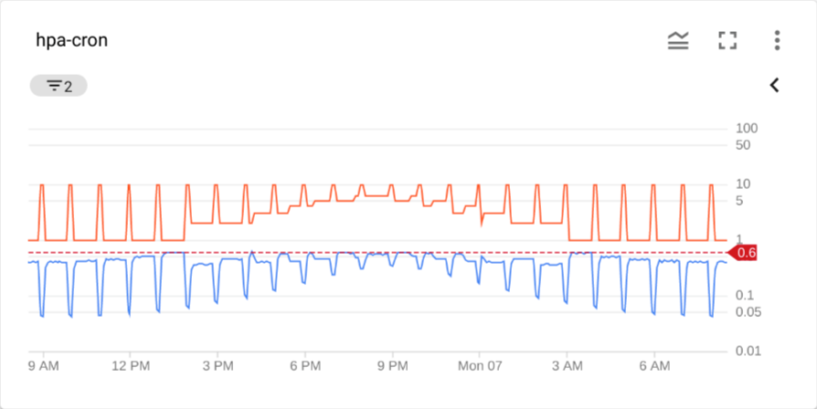

# hpa-cron
Example of how to scale HPA with a CronJob.

## Prerequisites

* [ko](https://github.com/google/ko)
* [Stackdriver Adapter](https://github.com/GoogleCloudPlatform/k8s-stackdriver/tree/master/custom-metrics-stackdriver-adapter)

## Usage

**`ko apply -f example.yaml`**

HPA will scale on an hourly schedule **and** CPU utilization (whichever is greater).

```
Every 2.0s: kubectl get hpa ; echo ; kubectl get cronjob ; echo ; kubectl get pods

NAME         REFERENCE               TARGETS              MINPODS   MAXPODS   REPLICAS   AGE
php-apache   Deployment/php-apache   1/1 (avg), 16%/60%   1         20        10         32m

NAME        SCHEDULE     SUSPEND   ACTIVE   LAST SCHEDULE   AGE
scale-in    1 * * * *    False     0        59m             36h
scale-out   50 * * * *   False     0        10m             36h

NAME                         READY   STATUS      RESTARTS   AGE
php-apache-5986bb6b9-5nd9s   1/1     Running     0          11m
php-apache-5986bb6b9-7749v   1/1     Running     0          10m
php-apache-5986bb6b9-7r4nd   1/1     Running     0          32m
php-apache-5986bb6b9-8fpdq   1/1     Running     0          10m
php-apache-5986bb6b9-cnfpm   1/1     Running     0          9m47s
php-apache-5986bb6b9-gpzc2   1/1     Running     0          9m47s
php-apache-5986bb6b9-hqjlt   1/1     Running     0          9m47s
php-apache-5986bb6b9-qzstt   1/1     Running     0          10m
php-apache-5986bb6b9-wn6hk   1/1     Running     0          11m
php-apache-5986bb6b9-wxqtd   1/1     Running     0          9m47s
scale-in-1599235260-pswp4    0/1     Completed   0          179m
scale-in-1599238860-zw2b4    0/1     Completed   0          119m
scale-in-1599242460-8wqjv    0/1     Completed   0          59m
scale-out-1599238200-jj7qr   0/1     Completed   0          130m
scale-out-1599241800-hn4zr   0/1     Completed   0          70m
scale-out-1599245400-zp45w   0/1     Completed   0          10m
```

With the example cron and a sine wave load:

```
while true; do \
  wget -q -O- http://php-apache.default.svc.cluster.local; \
  sleep $(date +%H | awk '{ print "s("$0"/3*a(1))*0.5+0.5" }' | bc -l); \
done
```



Pod count (orange) increases to 10 every hour on schedule.
Load naturally increases and decreases pod count over the day.
CPU utilization (blue) remains below the target (red).
